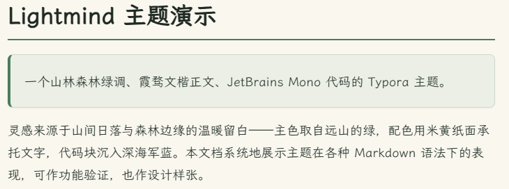
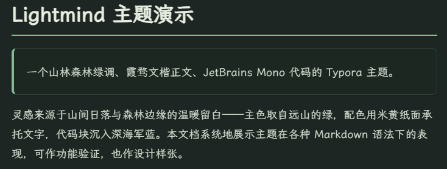
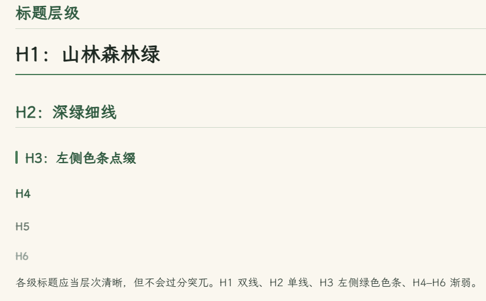
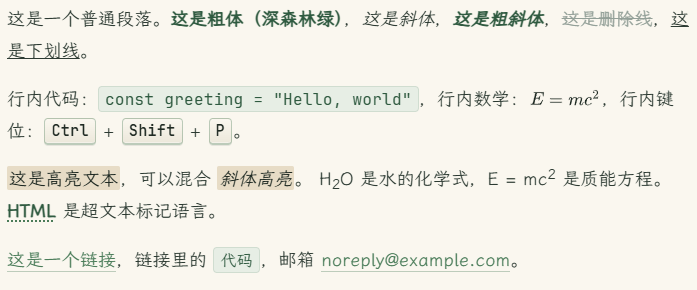
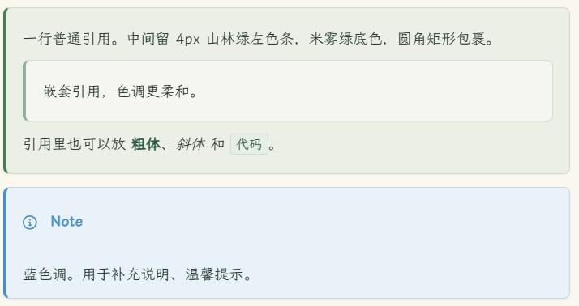
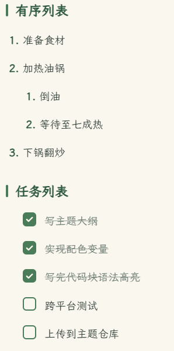
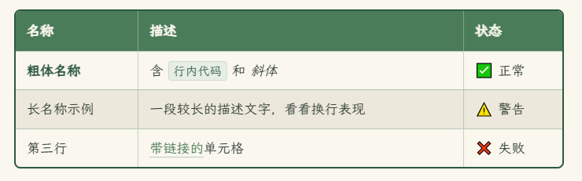
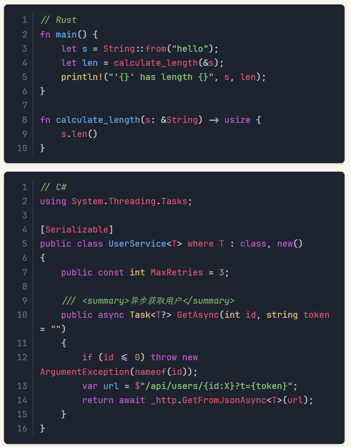
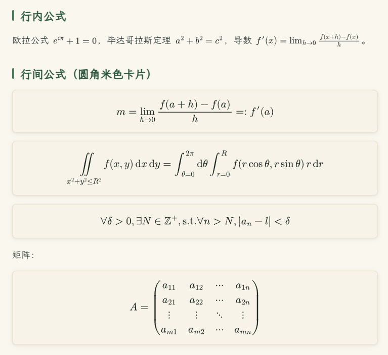
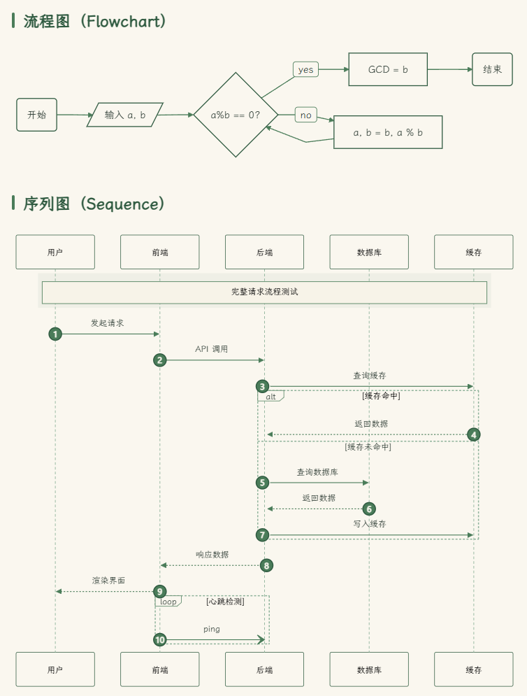

# Lightmind

> 一个山林氛围的 Typora 主题 — 森林绿、米黄纸面、深海军蓝代码块。**浅色 + 暗色** 双版本。

**[English README →](./README-en.md)**

---

为中英文混排长文写作设计的轻量 Typora 主题。正文用 **霞骛文楷 (LXGW WenKai)**，代码用 **JetBrains Mono**.

包含两个版本：

- **Lightmind**（`lightmind.css`）— 暖米色纸面 + 深森林强调色

  

- **Lightmind Dark**（`lightmind-dark.css`）— 深森林夜底 + 加亮绿色强调，代码块仍用同一深海军蓝

  

> ⚠️ **仅在 Windows（Typora 1.13.4）上测试通过。** macOS 与 Linux **未经测试**。理论上应该能正常工作（Typora 是 Electron 的，CSS 跨平台），但字体渲染、侧边栏度量、阴影表现可能略有差异。如有问题欢迎反馈或 PR。

## 预览

### 标题及正文



### 段落与行内格式



### 引用与警告块



### 列表



### 表格



### 代码



### 数学公式



### Mermaid 图表



---

看 [`showcase.md`](./showcase/showcase-zh.md)（中文）或 [`showcase-en.md`](./showcase/showcase-en.md)（英文）查看完整的 Markdown 元素渲染样张。

样张覆盖：

- 所有标题层级 (H1–H6)
- 段落 · 粗体 · 斜体 · 删除线 · 行内代码 · `<kbd>` · `<abbr>` · 上下标 · 高亮
- 引用块（普通与嵌套）
- 五种 GitHub 风格警告块（`> [!NOTE]`、`> [!TIP]`、`> [!IMPORTANT]`、`> [!WARNING]`、`> [!CAUTION]`）
- 列表（无序、有序、嵌套、任务列表）
- 表格（基础、对齐、复杂单元格）
- **Rust / C# / TypeScript** 代码块，One Dark 风格语法配色
- 行内公式 + 行间公式（圆角米色卡片）
- 14 种 Mermaid 图表：flowchart、sequence、class、state-v2、ER、gantt、pie、journey、mindmap、gitGraph、xychart、sankey、packet、zenUML

## 设计

### 浅色版（`lightmind.css`）

| 令牌 | 色值 | 用途 |
| :--- | :--- | :--- |
| `--bg-page` | `#f4f1e8` | 外层页面（暖米色纸面）|
| `--bg-write` | `#faf7ef` | 写作区（略亮一档）|
| `--bg-formula` | `#f7f3e8` | 公式块底色 |
| `--accent` | `#4a7c59` | 中山林绿 — 链接、强调 |
| `--accent-deep` | `#2f5a40` | 松林阴影 — 标题、加粗 |
| `--accent-soft` | `#8fb39b` | 雾色山脊 — 柔和边框 |
| `--accent-warm` | `#c2a878` | 阳光余晖 — 高亮、mark |
| `--code-bg` | `#1e2330` | 代码块深海军蓝 |
| `--code-fg` | `#c8cfd9` | 代码浅灰文字 |

### 暗色版（`lightmind-dark.css`）

| 令牌 | 色值 | 用途 |
| :--- | :--- | :--- |
| `--bg-page` | `#161d1a` | 外层页面（深森林夜底）|
| `--bg-write` | `#1d2622` | 写作区（略亮一档）|
| `--bg-formula` | `#1f2823` | 公式块底色 |
| `--accent` | `#7fbe92` | 加亮山林绿 — 链接、强调 |
| `--accent-deep` | `#a8d4b6` | 月光石青 — 标题、加粗 |
| `--accent-soft` | `#5a7d68` | 暗夜雾色 — 柔和边框 |
| `--accent-warm` | `#d8bd86` | 暖金 — 高亮、mark |
| `--code-bg` | `#14181f` | 代码块（比页面更深一档以拉对比）|
| `--code-fg` | `#c8cfd9` | 代码浅灰文字 |

**两个版本** 的代码块语法配色都采用 **One Dark** 调色板：紫色关键字、金色类型名、绿色字符串、暖红色变量、蓝色函数名。

## 安装

1. 把 `lightmind.css`（以及可选的 `lightmind-dark.css`）复制到 Typora 主题文件夹：

   - **Windows**（已测试）: `%APPDATA%\Typora\themes\`
   - **macOS**（未测试）: `~/Library/Application Support/abnerworks.Typora/themes/`
   - **Linux**（未测试）: `~/.config/Typora/themes/`

   或在 Typora 中打开 `偏好设置` → `外观` → 点击 **打开主题文件夹**。

2. 重启 Typora，从 `主题` 菜单选择 **Lightmind** 或 **Lightmind Dark**。

> 修改 CSS 后 Typora 不一定会热更新。可以切到别的主题再切回来，或者重启 Typora。

## 推荐字体

主题在不安装任何字体时也能用（会回退到系统字体），但为了达到设计意图，建议装：

- **[LXGW WenKai 霞骛文楷](https://github.com/lxgw/LxgwWenKai)** — 正文 / 中文
- **[JetBrains Mono](https://www.jetbrains.com/lp/mono/)** — 代码

两者都开源免费。

> **提示**：JetBrains Mono 不含中文字形，所以代码块里的中文会回退到霞骛文楷（楷体风格，不严格等宽）。如果你需要中文严格等宽对齐，建议装 **[Sarasa Mono SC 更纱黑体](https://github.com/be5invis/Sarasa-Gothic)**，并把它加到 `--font-mono` 字体栈里。

## 自定义

主题在 `lightmind.css` 顶部的 `:root` 里定义了所有关键令牌。可以直接修改文件，或在 Typora 里添加一份自定义 CSS 来覆盖。例如：

```css
:root {
    /* 更暖的纸面 */
    --bg-page: #f7f3e3;

    /* 更深的强调绿 */
    --accent: #2f8246;

    /* 更亮的代码块 */
    --code-bg: #2a3142;
}

#write {
    /* 更宽的写作区 */
    max-width: 960px;

    /* 更大的正文字号 */
    font-size: 18px;
}
```

## 兼容性

- **已测试平台**：Windows 10/11 上的 Typora 1.13.4。
- **未测试平台**：macOS、Linux。理论上能用（Typora 是 Electron，CSS 跨平台），但作者没有验证过。出问题欢迎提 issue。
- **GFM 警告块** (`> [!NOTE]` 等) 需要 Typora 1.7+ — 较老版本会渲染成普通引用块。
- **Mermaid 图表** 针对 Typora 当前的 SVG 渲染器优化；老版 Typora 渲染可能会有微小差异。
- 主题使用了 CSS `:has()` 选择器，需要较新的 Chromium 内核（Typora ≥ ~1.5 自带）。

## 致谢

- **代码配色** — Atom 编辑器的 One Dark 主题
- **字体** — 霞骛文楷由 [lxgw](https://github.com/lxgw) 维护，JetBrains Mono 由 JetBrains 设计
- **GitHub 警告 class** — Typora 1.13+ 原生的 `md-alert` 渲染

## 许可

MIT — 欢迎 fork、修改、分享。

---

> Made with `lightmind.css` · 山林之间，文字生长。
