# Lightmind Theme Showcase

> A Typora theme with mountain forest greens, LXGW WenKai for body text, and JetBrains Mono for code.

Inspired by the warm space at the edge of a forest at sunset — accent color drawn from distant mountain greens, cream paper holding the text, code blocks sinking into a deep navy. This document systematically demonstrates how the theme handles every Markdown element. It works as a functional check and a design sample.

## Heading Hierarchy

# H1: mountain forest green
## H2: thin deep-green line
### H3: left-side color bar accent
#### H4
##### H5
###### H6

Heading levels should feel clearly differentiated, but not overwhelming. H1 has a double-line, H2 a single line, H3 a green bar on the left, H4–H6 fade gracefully.

## Paragraph & Inline Formatting

This is a regular paragraph. **This is bold (deep forest green)**, *this is italic*, ***this is bold-italic***, ~~this is strikethrough~~, <u>this is underline</u>.

Inline code: `const greeting = "Hello, world"`, inline math: $E = mc^2$, inline keys: <kbd>Ctrl</kbd> + <kbd>Shift</kbd> + <kbd>P</kbd>.

==This is highlighted text==, mixable with *==italic highlight==*. H<sub>2</sub>O is the chemical formula for water, E = mc<sup>2</sup> is the mass-energy equivalence. <abbr title="HyperText Markup Language">HTML</abbr> is HyperText Markup Language.

[This is a link](https://typora.io), `code` inside a link, email <noreply@example.com>.

## Blockquotes & Alerts

> A regular blockquote. 4px green left bar, misty meadow background, rounded card.
>
> > Nested quote, slightly softer tone.
>
> Quotes can also contain **bold**, *italic*, and `code`.

> [!NOTE]
> Blue tone. For supplementary information or friendly reminders.

> [!TIP]
> Theme green. For practical advice or best practices.

> [!IMPORTANT]
> Purple tone. For critical information not to be ignored.

> [!WARNING]
> Warm orange. Pay attention — this may affect outcomes.

> [!CAUTION]
> Brick red. Dangerous operations or destructive changes.

## Lists

### Unordered List

- First item
- Second item
  - Nested: hollow marker
  - Nested two
    - Three levels deep
- Third item

### Ordered List

1. Prepare ingredients
2. Heat the wok
   1. Pour oil
   2. Wait until 70% hot
3. Stir-fry

### Task List

- [x] Draft theme outline
- [x] Implement color tokens
- [x] Finalize syntax highlighting
- [ ] Cross-platform testing
- [ ] Publish to theme repo

## Tables

### Basic Table

| OS         | Global % | China % |
| ---------- | -------- | ------- |
| Windows    | 76.56    | 87.55   |
| macOS      | 17.10    | 5.44    |
| Linux      | 1.93     | 0.75    |
| Chrome OS  | 1.72     | 0.01    |
| Other      | 2.69     | 6.25    |

### Alignment

| Left   | Center | Right |
| :----- | :----: | ----: |
| Apple  | apple  |   1.0 |
| Banana | banana |   2.5 |
| Cherry | cherry |  18.7 |

### Cells with Complex Content

| Name | Description | Status |
| ---- | ---- | ---- |
| **Bold name** | Contains `inline code` and *italic* | ✅ OK |
| Long name example | A longer description to see how wrapping behaves | ⚠️ Warning |
| Third row | A [linked](https://example.com) cell | ❌ Failed |

## Code

### Inline Code

Run `npm install` then `npm run dev`, and visit `http://localhost:3000`.

### Code Blocks (Multi-language)

The syntax highlighting palette is inspired by the One Dark theme.

```rust
// Rust
fn main() {
    let s = String::from("hello");
    let len = calculate_length(&s);
    println!("'{}' has length {}", s, len);
}

fn calculate_length(s: &String) -> usize {
    s.len()
}
```

```C#
// C#
using System.Threading.Tasks;

[Serializable]
public class UserService<T> where T : class, new()
{
    public const int MaxRetries = 3;

    /// <summary>Asynchronously fetch a user.</summary>
    public async Task<T?> GetAsync(int id, string token = "")
    {
        if (id <= 0) throw new ArgumentException(nameof(id));
        var url = $"/api/users/{id:X}?t={token}";
        return await _http.GetFromJsonAsync<T>(url);
    }
}
```

```typescript
// TypeScript
import { Injectable } from '@nestjs/common';
import type { AuthToken } from './types';

/** Authentication service */
@Injectable()
export class AuthService {
    public static readonly MAX_ATTEMPTS = 5;
    private cache = new Map<string, AuthToken>();

    async login(email: string, pwd: string): Promise<AuthToken | null> {
        if (!email.includes('@') || pwd.length < 8)
            throw new Error(`Invalid: ${email}`);
        return { token: 'abc', expiresIn: 3600, valid: true };
    }
}
```

## Math

### Inline Math

Euler's identity $e^{i\pi} + 1 = 0$, the Pythagorean theorem $a^2 + b^2 = c^2$, the derivative $f'(x) = \lim_{h \to 0} \frac{f(x+h) - f(x)}{h}$.

### Display Math (rounded cream cards)

$$
m = \lim_{h \to 0} \frac{f(a + h) - f(a)}{h} =: f'(a)
$$

$$
\iint\limits_{x^2 + y^2 \leq R^2} f(x,y)\,\mathrm{d}x\,\mathrm{d}y = \int_{\theta=0}^{2\pi} \mathrm{d}\theta \int_{r=0}^R f(r\cos\theta, r\sin\theta)\, r\,\mathrm{d}r
$$

$$
\forall \delta > 0, \exists N \in \mathbb{Z}^+, \text{s.t.} \forall n > N, |a_n - l| < \delta
$$

Matrix:

$$
A = \begin{pmatrix}
a_{11} & a_{12} & \cdots & a_{1n} \\
a_{21} & a_{22} & \cdots & a_{2n} \\
\vdots & \vdots & \ddots & \vdots \\
a_{m1} & a_{m2} & \cdots & a_{mn}
\end{pmatrix}
$$

## Mermaid Diagrams

### Flowchart

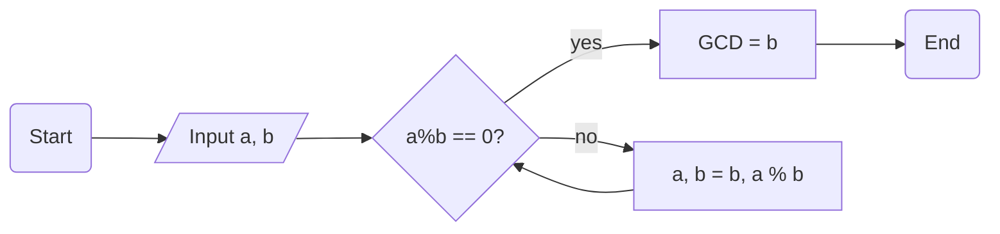

### Sequence

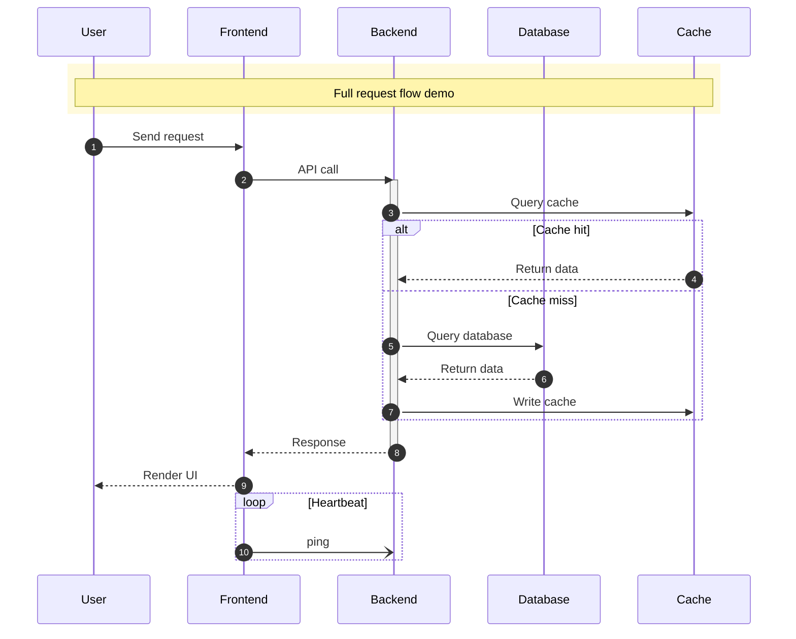

### Class Diagram

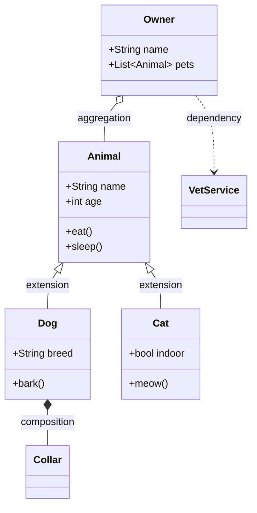

### State Diagram v2

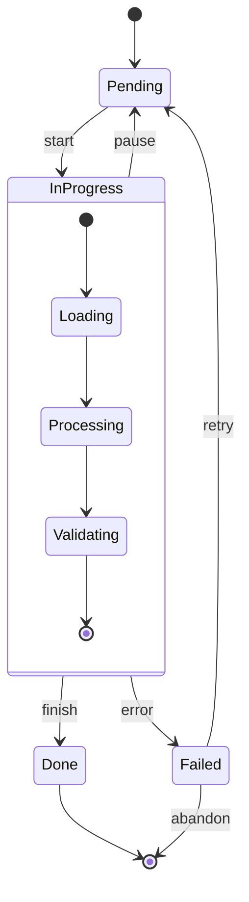

### Entity-Relationship Diagram

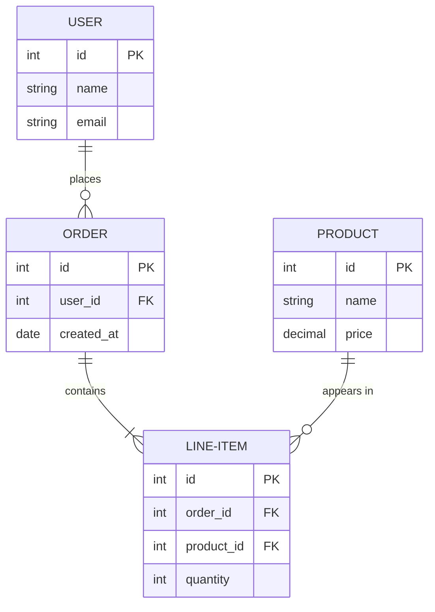

### Gantt

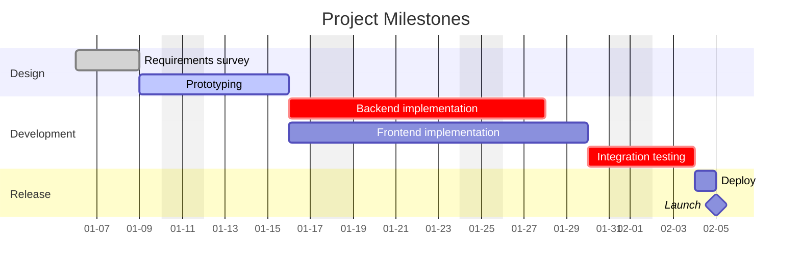

### Pie

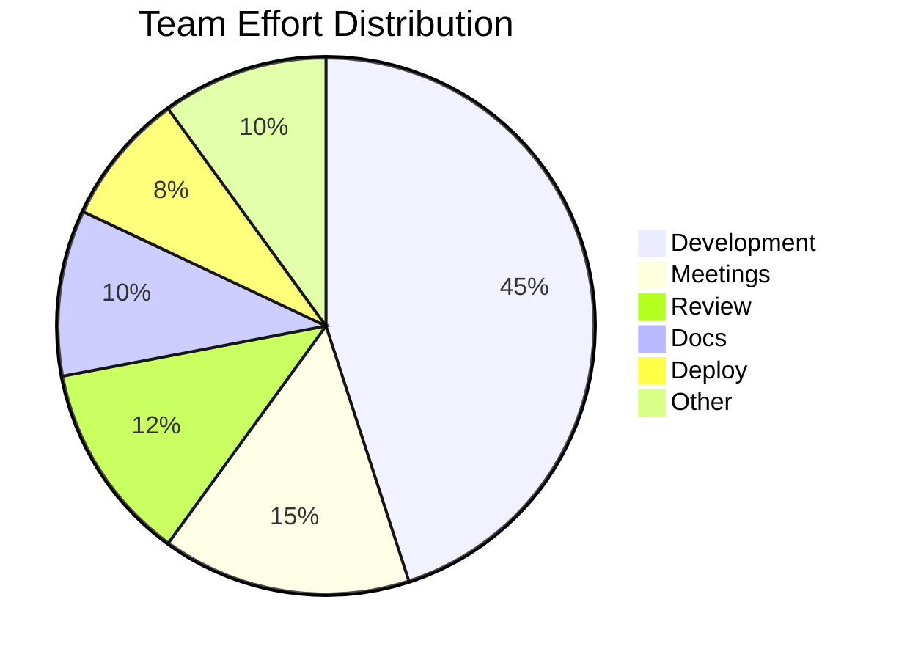

### Journey

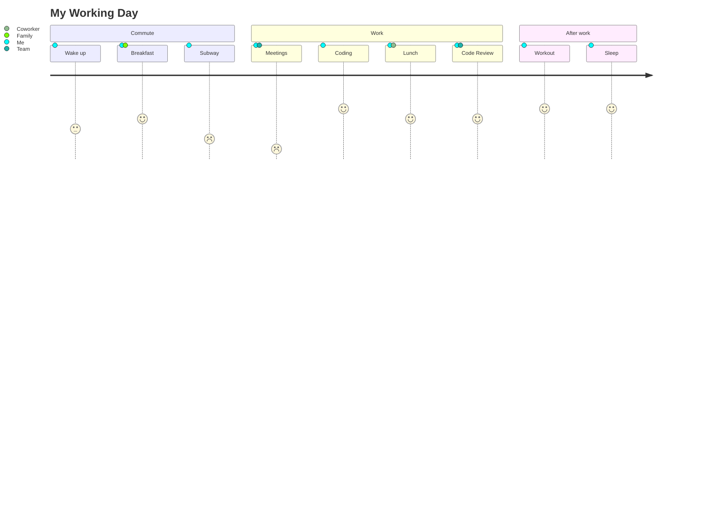

### Mindmap

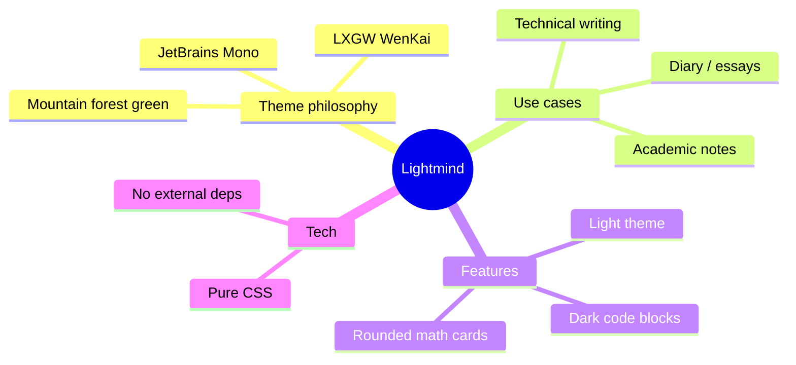

### Git Graph

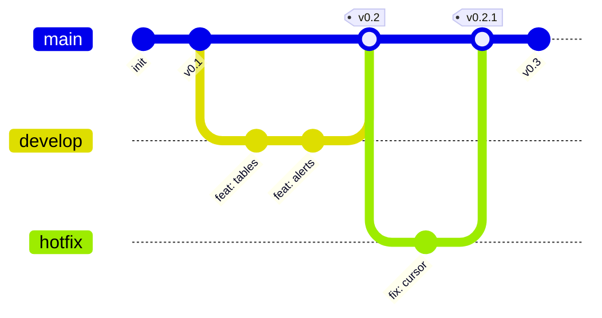

### XY Chart

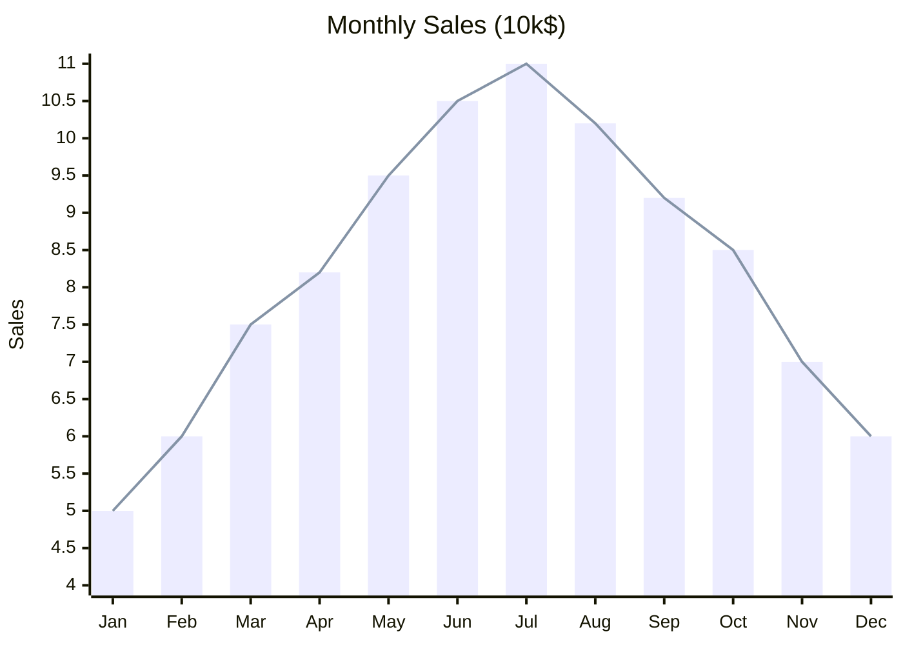

### Packet Diagram

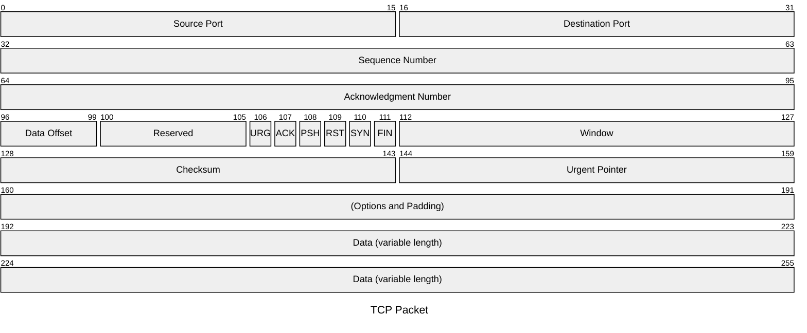

## Images

Inline image: 

Centered standalone image:


## Footnotes

The pairing of LXGW WenKai[^1] with JetBrains Mono[^2] is the heart of this theme.

[^1]: LXGW WenKai — an open-source Chinese font maintained by lxgw, derived from FZ Xinkai.
[^2]: JetBrains Mono — a monospaced programming font designed by JetBrains, with ligatures.

## Alerts via Raw HTML

<div class="alert alert-tip">
<p>This is a tip block written in raw HTML (a fallback for older Typora versions that don't render GFM Alerts).</p>
</div>

## Horizontal Rule

The horizontal rule is a soft gradient.

---

## Conclusion

If everything above renders harmoniously —
- Paragraphs breathe naturally without friction
- Code blocks feel deep but not harsh
- Math cards melt into the page background
- Tables have clear inner / outer hierarchy
- Diagrams echo the body's color palette
- Mermaid diagrams show no out-of-place purples or blues

then the theme is ready to use.

> Made with `lightmind.css` · words growing among the mountains.
