# Lightmind 主题演示

> 一个山林森林绿调、霞骛文楷正文、JetBrains Mono 代码的 Typora 主题。

灵感来源于山间日落与森林边缘的温暖留白——主色取自远山的绿，配色用米黄纸面承托文字，代码块沉入深海军蓝。本文档系统地展示主题在各种 Markdown 语法下的表现，可作功能验证，也作设计样张。

## 标题层级

# H1：山林森林绿
## H2：深绿细线
### H3：左侧色条点缀
#### H4
##### H5
###### H6

各级标题应当层次清晰，但不会过分突兀。H1 双线、H2 单线、H3 左侧绿色色条、H4–H6 渐弱。

## 段落与行内格式

这是一个普通段落。**这是粗体（深森林绿）**，*这是斜体*，***这是粗斜体***，~~这是删除线~~，<u>这是下划线</u>。

行内代码：`const greeting = "Hello, world"`，行内数学：$E = mc^2$，行内键位：<kbd>Ctrl</kbd> + <kbd>Shift</kbd> + <kbd>P</kbd>。

==这是高亮文本==，可以混合 *==斜体高亮==*。 H<sub>2</sub>O 是水的化学式，E = mc<sup>2</sup> 是质能方程。<abbr title="HyperText Markup Language">HTML</abbr> 是超文本标记语言。

[这是一个链接](https://typora.io)，链接里的 `代码`，邮箱 <noreply@example.com>。

## 引用块与警告块

> 一行普通引用。中间留 4px 山林绿左色条，米雾绿底色，圆角矩形包裹。
>
> > 嵌套引用，色调更柔和。
>
> 引用里也可以放 **粗体**、*斜体* 和 `代码`。

> [!NOTE]
> 蓝色调。用于补充说明、温馨提示。

> [!TIP]
> 主色绿。用于实用建议、最佳实践。

> [!IMPORTANT]
> 紫色调。用于关键信息，不容忽视。

> [!WARNING]
> 暖橙黄。需要注意，可能影响结果。

> [!CAUTION]
> 砖红调。危险操作或破坏性变更。

## 列表

### 无序列表

- 第一项
- 第二项
  - 嵌套：空心 marker
  - 嵌套二
    - 三层嵌套
- 第三项

### 有序列表

1. 准备食材
2. 加热油锅
   1. 倒油
   2. 等待至七成热
3. 下锅翻炒

### 任务列表

- [x] 写主题大纲
- [x] 实现配色变量
- [x] 写完代码块语法高亮
- [ ] 跨平台测试
- [ ] 上传到主题仓库

## 表格

### 基本表格

| OS         | 全球占比 | 中国占比 |
| ---------- | -------- | -------- |
| Windows    | 76.56    | 87.55    |
| macOS      | 17.10    | 5.44     |
| Linux      | 1.93     | 0.75     |
| Chrome OS  | 1.72     | 0.01     |
| 其他       | 2.69     | 6.25     |

### 对齐方式

| 左对齐 | 居中 | 右对齐 |
| :----- | :--: | -----: |
| Apple  | 苹果 |    1.0 |
| Banana | 香蕉 |    2.5 |
| Cherry | 樱桃 |   18.7 |

### 单元格里的复杂内容

| 名称 | 描述 | 状态 |
| ---- | ---- | ---- |
| **粗体名称** | 含 `行内代码` 和 *斜体* | ✅ 正常 |
| 长名称示例 | 一段较长的描述文字，看看换行表现 | ⚠️ 警告 |
| 第三行 | [带链接的](https://example.com)单元格 | ❌ 失败 |

## 代码

### 行内代码

下载 `npm install` 后运行 `npm run dev`，访问 `http://localhost:3000`。

### 代码块（多语言）

语法高亮颜色借鉴了 One Dark 主题。

```rust
// Rust
fn main() {
    let s = String::from("hello");
    let len = calculate_length(&s);
    println!("'{}' has length {}", s, len);
}

fn calculate_length(s: &String) -> usize {
    s.len()
}
```

```C#
// C#
using System.Threading.Tasks;

[Serializable]
public class UserService<T> where T : class, new()
{
    public const int MaxRetries = 3;

    /// <summary>异步获取用户</summary>
    public async Task<T?> GetAsync(int id, string token = "")
    {
        if (id <= 0) throw new ArgumentException(nameof(id));
        var url = $"/api/users/{id:X}?t={token}";
        return await _http.GetFromJsonAsync<T>(url);
    }
}
```

```typescript
// TypeScript
import { Injectable } from '@nestjs/common';
import type { AuthToken } from './types';

/** 用户认证服务 */
@Injectable()
export class AuthService {
    public static readonly MAX_ATTEMPTS = 5;
    private cache = new Map<string, AuthToken>();

    async login(email: string, pwd: string): Promise<AuthToken | null> {
        if (!email.includes('@') || pwd.length < 8)
            throw new Error(`Invalid: ${email}`);
        return { token: 'abc', expiresIn: 3600, valid: true };
    }
}
```

## 数学公式

### 行内公式

欧拉公式 $e^{i\pi} + 1 = 0$，毕达哥拉斯定理 $a^2 + b^2 = c^2$，导数 $f'(x) = \lim_{h \to 0} \frac{f(x+h) - f(x)}{h}$。

### 行间公式（圆角米色卡片）

$$
m = \lim_{h \to 0} \frac{f(a + h) - f(a)}{h} =: f'(a)
$$

$$
\iint\limits_{x^2 + y^2 \leq R^2} f(x,y)\,\mathrm{d}x\,\mathrm{d}y = \int_{\theta=0}^{2\pi} \mathrm{d}\theta \int_{r=0}^R f(r\cos\theta, r\sin\theta)\, r\,\mathrm{d}r
$$

$$
\forall \delta > 0, \exists N \in \mathbb{Z}^+, \text{s.t.} \forall n > N, |a_n - l| < \delta
$$

矩阵：

$$
A = \begin{pmatrix}
a_{11} & a_{12} & \cdots & a_{1n} \\
a_{21} & a_{22} & \cdots & a_{2n} \\
\vdots & \vdots & \ddots & \vdots \\
a_{m1} & a_{m2} & \cdots & a_{mn}
\end{pmatrix}
$$

## Mermaid 图表

### 流程图（Flowchart）

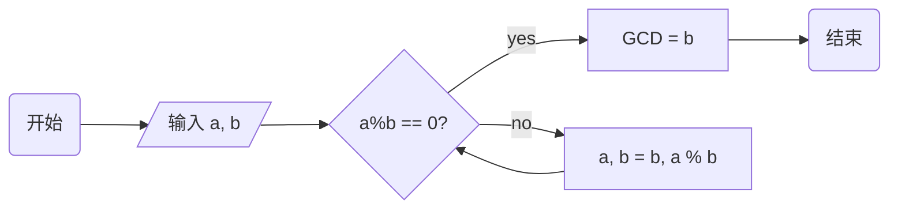

### 序列图（Sequence）

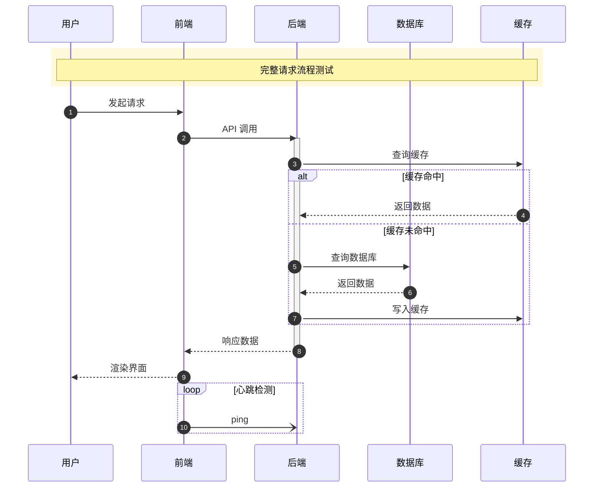

### 类图（Class Diagram）

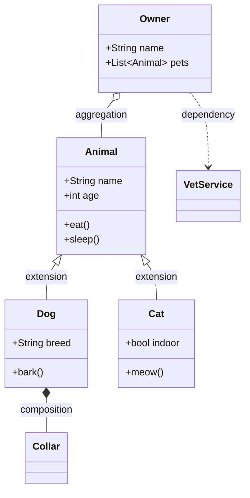

### 状态图（State Diagram v2）

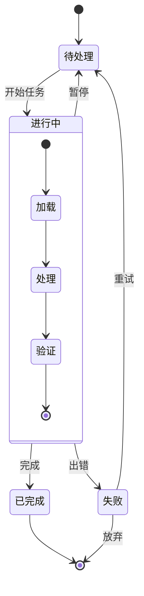

### 实体关系图（ER）

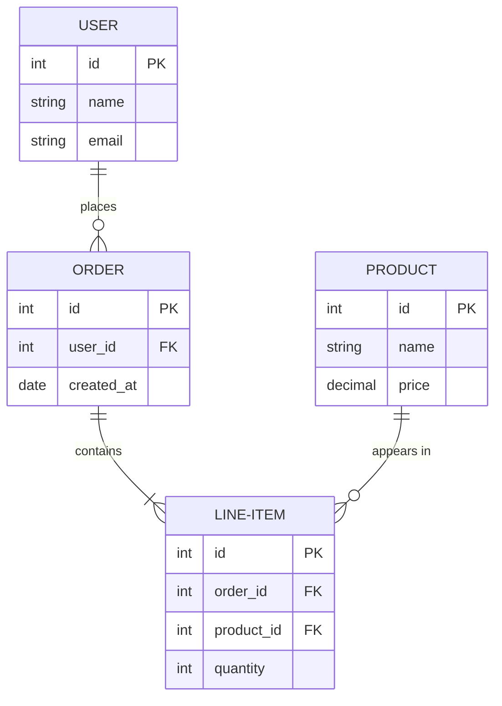

### 甘特图（Gantt）

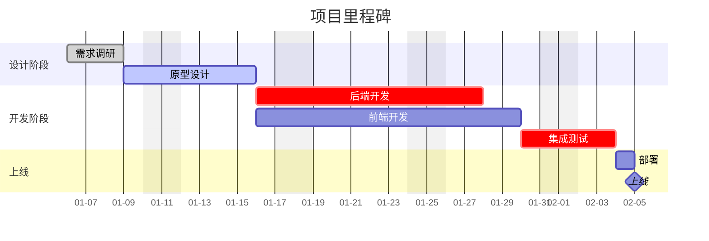

### 饼图（Pie）

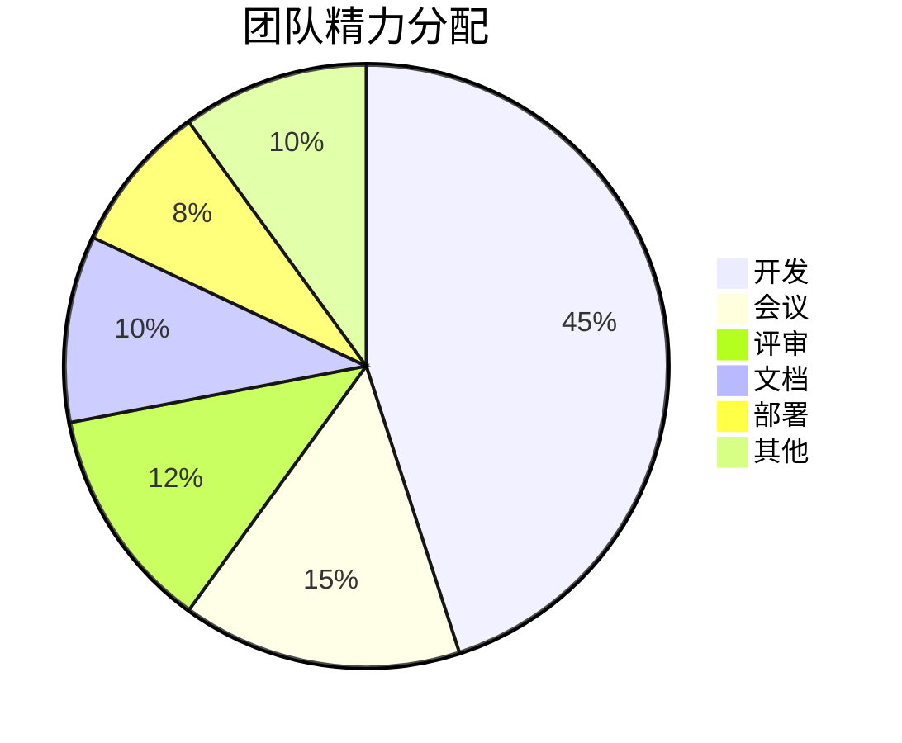

### 用户旅程（Journey）

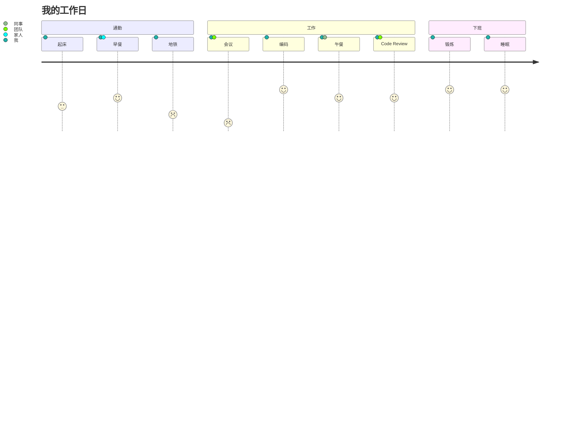

### 思维导图（Mindmap）

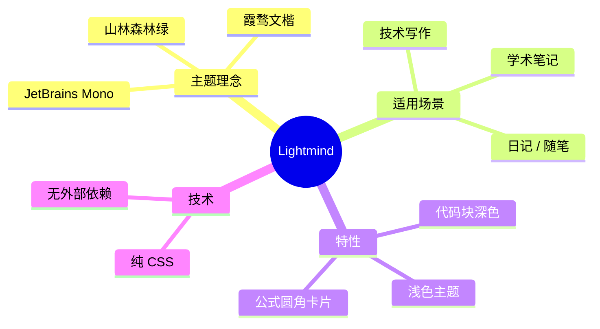

### Git 图（GitGraph）

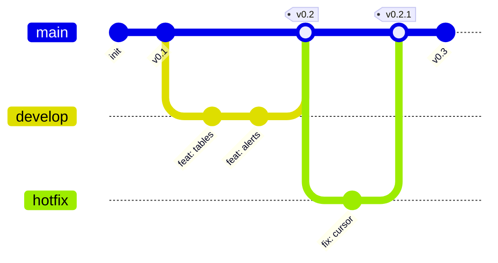

### 时序坐标图（XY Chart）

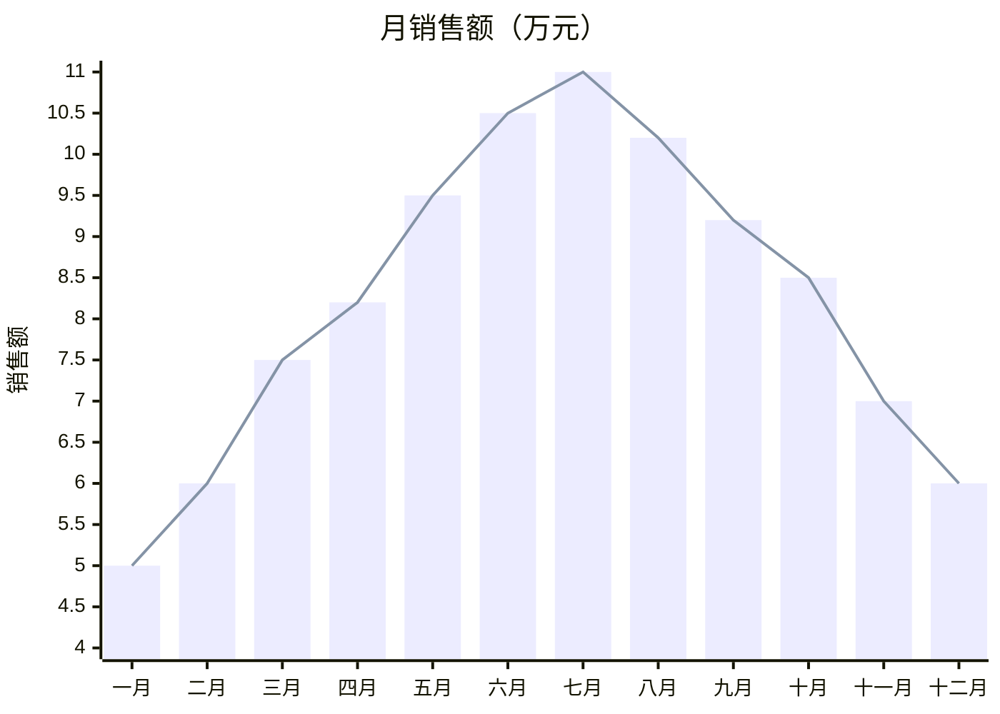

### Sankey 桑基图

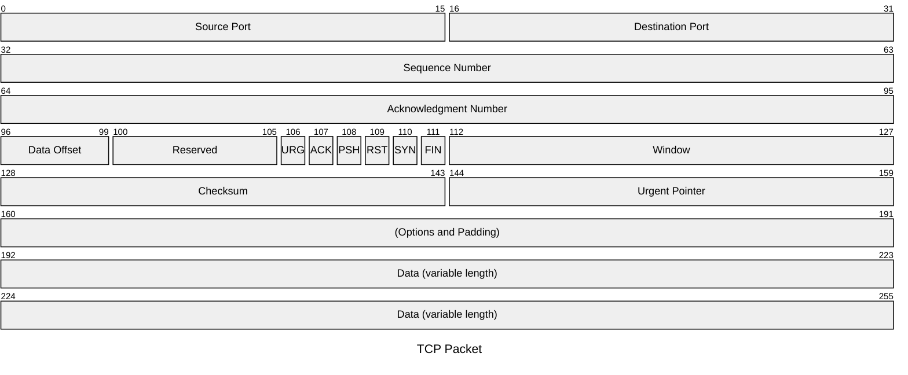

## 图片

文字行内的图片：

居中独立图片：


## 脚注

霞骛文楷[^1] 与 JetBrains Mono[^2] 的搭配是这个主题的核心。

[^1]: LXGW WenKai，由 lxgw 维护的开源中文字体，基于霞鹜新晰黑改造。
[^2]: JetBrains Mono，由 JetBrains 设计的等宽编程字体，支持连字。

## 警告与原始 HTML

<div class="alert alert-tip">
<p>这是用原始 HTML 写的提示框（如果版本不支持 GFM Alerts，可降级到这种写法）。</p>
</div>
## 分隔线

分隔线是渐变色。

---

## 总结

如果以上各部分都呈现得自然协调——
- 段落的呼吸节奏不卡顿
- 代码块深色不刺眼
- 公式圆角米色卡片融入页面
- 表格内外框层次分明
- 图表配色与正文呼应
- mermaid 各类图都不见违和的紫色蓝色

那么这个主题已经基本可用了。

> Made with `lightmind.css` · 山林之间，文字生长。
